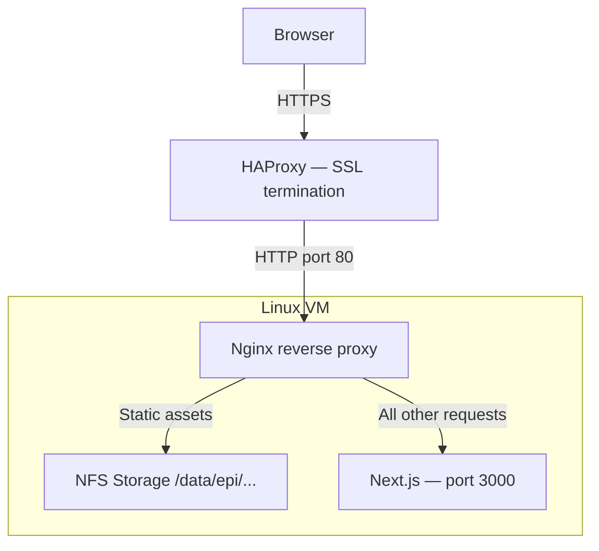

# Nginx Integration Guide

This document describes how Nginx integrates with the Next.js application, both in production and in the local Docker test environment.

## Production Architecture



1. **HAProxy** terminates SSL and forwards traffic on port 80, setting `X-Forwarded-For` and `X-Forwarded-Proto`.
2. **Nginx** validates the `Host` header via regex, serves static assets from NFS, adds security headers, and proxies everything else to Node.js.
3. **Next.js** middleware detects the journal from the `Host` header and routes to `/sites/[journalId]/[lang]/...`.

## Production Configuration

The production template is at `deployment/production/nginx-episciences.conf.template`.

It is rendered via `envsubst` before deployment:

```bash
export EPI_ENV=prod
export DOMAIN_SUFFIX=episciences.org
export HAPROXY_CIDR=10.0.0.0/8   # HAProxy appliance IP range

envsubst '${EPI_ENV} ${DOMAIN_SUFFIX} ${HAPROXY_CIDR}' \
  < deployment/production/nginx-episciences.conf.template \
  > /etc/nginx/conf.d/episciences.conf

nginx -t && systemctl reload nginx
```

### Key features

**Multi-tenant routing** — a single `server` block handles all journals via a hostname regex:

```nginx
server_name "~^(?P<journal_code>[a-z0-9-]{2,50})\.${DOMAIN_SUFFIX}$";
```

No reload is needed when adding a new journal.

**Static asset serving** — NFS-mounted files bypass Node.js entirely:

| Location | NFS path |
|---|---|
| `/sitemap.xml` | `/data/epi/<env>/<journal>/sitemap/sitemap.xml` |
| `/public/documents/` | `/data/epi/<env>/<journal>/public/documents/` |
| `/volumes-full/` | `/data/epi/<env>/<journal>/public/volume-pdf/` |
| `/volumes-doaj/` | `/data/epi/<env>/<journal>/public/volume-doaj/` |
| `/public/volumes/` | `/data/epi/<env>/<journal>/public/volumes/` |
| `/user/picture/` | `/data/user_photo/<env>/uuid/` |

**Security headers** — applied by Nginx so they are consistent regardless of Next.js version.
Next.js response headers are stripped first (`proxy_hide_header`) to avoid duplicates:

| Header | Value |
|---|---|
| `Content-Security-Policy` | See below |
| `X-Frame-Options` | `SAMEORIGIN` |
| `X-Content-Type-Options` | `nosniff` |
| `Referrer-Policy` | `strict-origin-when-cross-origin` |
| `Permissions-Policy` | `camera=(), microphone=(), geolocation=()` |

**Content Security Policy** rationale:

| Directive | Extra sources | Reason |
|---|---|---|
| `script-src` | `'unsafe-inline'` | Next.js hydration inline scripts |
| | `cdnjs.cloudflare.com` | MathJax CDN |
| | `piwik-episciences.ccsd.cnrs.fr` | Matomo analytics |
| `style-src` | `'unsafe-inline'` | Next.js inline styles |
| `img-src` | `data:` | Blur placeholders (Next.js Image) |
| | `blob:` | MathJax canvas blobs |
| | `https://*.episciences.org` | Article thumbnails, board photos (API) |
| `font-src` | `cdnjs.cloudflare.com` | MathJax fonts |
| `connect-src` | `https://*.episciences.org` | API calls |
| | `https://piwik-episciences.ccsd.cnrs.fr` | Matomo beacon |
| `worker-src` | `blob:` | MathJax Web Workers (blob URLs) |
| | `cdnjs.cloudflare.com` | MathJax worker scripts from CDN |
| `frame-src` / `object-src` | `'none'` | No embeds |

**Gzip compression** is enabled for text, JSON, JS, CSS, SVG, and WOFF2.

## Local Docker Test Environment

Two modes are available. Both use the same Nginx image and config template
(`docker/nginx-config/episciences.conf.template`), so security headers and routing
behave identically to production.

### Dev mode — hot-reload + Nginx (recommended)

Nginx runs in Docker; Next.js runs locally via `npm run dev`.
Changes are reflected immediately without rebuilding Docker images.

```bash
# Terminal 1
npm run dev

# Terminal 2
make dev-nginx          # builds Nginx image if needed, then starts it
make dev-nginx-logs     # optional: stream access/error logs
make dev-nginx-down     # stop
make dev-nginx-rebuild  # force image rebuild (e.g. after template changes)
```

Nginx proxies to `host.docker.internal:3000`.
On Linux, `host-gateway` is used to resolve `host.docker.internal` automatically.

### Production-like mode — full Docker stack

Both the Next.js app and Nginx run in Docker. Use this to validate the standalone build,
ISR behaviour, or Docker-specific issues.

```bash
make build    # npm run build + docker compose build
make up       # start Nginx + Next.js containers
make logs     # stream logs
make down     # stop
```

### Template variables

| Variable | Default | Description |
|---|---|---|
| `EPI_ENV` | `test` | Data path segment (`/data/epi/<EPI_ENV>/...`) |
| `DOMAIN_SUFFIX` | `episciences.test` | Matched in `server_name` regex |
| `NEXT_UPSTREAM` | `app:3000` (prod-like) / `host.docker.internal:3000` (dev) | Proxy target |

### /etc/hosts entries

```bash
make hosts   # prints required entries for the current JOURNALS variable
```

Default (add to `/etc/hosts`):

```text
127.0.0.1  epijinfo.episciences.test
127.0.0.1  dmtcs.episciences.test
```

Then access: `http://epijinfo.episciences.test:8080`

## Apache → Nginx migration

Apache was previously used in production via `deployment/production/apache-episciences.conf`
(macro-based, one `VirtualHost` per journal). It has been replaced by the Nginx template.

| | Apache (legacy) | Nginx |
|---|---|---|
| Multi-tenancy | `mod_macro` + one VirtualHost per journal | Single `server` block with hostname regex |
| New journal | Requires config edit + reload | Zero-config (regex matches automatically) |
| Security headers | `mod_headers` | Native `add_header` + `proxy_hide_header` |
| CSP | Not configured | Fully defined in template |
| Static assets | `Alias` directives | `alias` / `location` blocks |
| Gzip | `mod_deflate` | Native `gzip` module |
