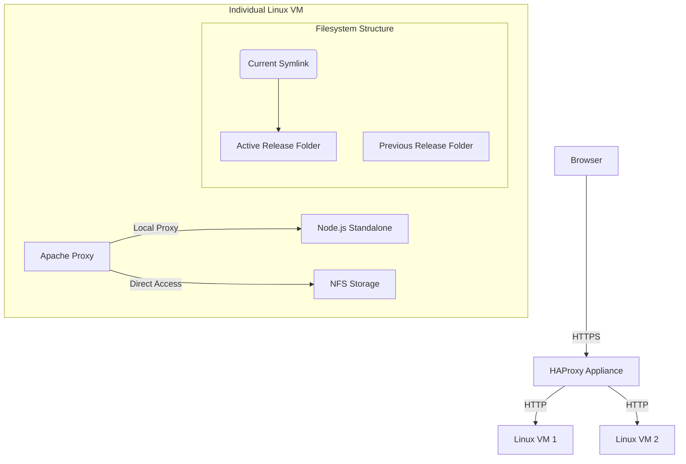

# Production Deployment Guide (Versioning & Rollback)

This document describes the process for deploying the Episciences Next.js application on a cluster of Linux VMs using a **Symlink Rotation** strategy for zero-downtime deployments and easy rollbacks.

## 🏗 Architecture Overview



---

## 📦 1. Build and Package

Run the preparation script on your build server. **You must specify a branch or tag name.**

```bash
# Usage: ./scripts/prepare-deploy.sh <branch-or-tag>
./scripts/prepare-deploy.sh main
```

**What the script does:**
1. Fetches all branches/tags and validates your input.
2. Checks out the code.
3. Generates a unique `BUILD_ID` (e.g., `20260207-1430-main-a1b2c3`).
4. Builds the application in `standalone` mode.
5. Packages everything into `episciences-release-<BUILD_ID>.tar.gz`.

---

## 🚀 2. Server Setup (First Time)

### Prerequisites
- Node.js 20+
- Apache 2.4+ (with `mod_macro`, `mod_proxy_http`, `mod_remoteip`)

### Directories
```bash
mkdir -p /var/www/episciences-front-next/releases
mkdir -p /var/www/episciences-front-next/scripts
chown -R www-data:www-data /var/www/episciences-front-next
```

### Systemd Service
Create `/etc/systemd/system/episciences-next.service`:
```ini
[Unit]
Description=Episciences Next.js Frontend
After=network.target

[Service]
Type=simple
User=www-data
Group=www-data
WorkingDirectory=/var/www/episciences-front-next/current
ExecStart=/usr/bin/node server.js
Restart=always
Environment=NODE_ENV=production
Environment=PORT=3000
Environment=HOSTNAME=127.0.0.1

[Install]
WantedBy=multi-user.target
```

### 3.1 Cluster Cache Synchronization (CRITICAL)

In a cluster, each node has its own local cache. To ensure that "Publishing" an article updates ALL nodes, you must configure them to talk to each other.

**Add the `PEER_SERVERS` environment variable to your systemd service file.**

**Example for a 4-node cluster:**
Each node must list the IPs of the 3 other nodes.
- **VM1 (10.0.0.1)**: `PEER_SERVERS=http://10.0.0.2:3000,http://10.0.0.3:3000,http://10.0.0.4:3000`
- **VM2 (10.0.0.2)**: `PEER_SERVERS=http://10.0.0.1:3000,http://10.0.0.3:3000,http://10.0.0.4:3000`
- (and so on)

### 3.2 Security & Rate Limiting

The revalidation API is protected by:
1. **IP Whitelisting**: Set `ALLOWED_IPS` to your HAProxy/CMS internal IPs.
2. **Token**: Set `REVALIDATION_SECRET` or journal-specific tokens.
3. **Rate Limit**: Default is **100 requests per minute**. You can adjust this in the systemd service:
   `Environment=REVALIDATE_RATE_LIMIT=200`

*Important: If you perform bulk updates, ensure your CMS (Symfony) uses a message queue (Messenger) to handle retries if the rate limit is hit.*

---

## 🛡 3. HAProxy Configuration (Appliance)

Since HAProxy handles SSL termination, it must pass the correct headers:

```haproxy
backend episciences_cluster
    mode http
    balance roundrobin
    option httpchk GET /
    http-check expect status 200
    
    option forwardfor
    http-request set-header X-Forwarded-Proto https if { ssl_fc }

    server node-01 10.0.0.1:80 check
    server node-02 10.0.0.2:80 check
```

---

## 🔄 4. Deployment Routine

To deploy a new version:

1. **Transfer** the `.tar.gz` to the server.
2. **Execute** the deployment script:
   ```bash
   # The script is included in the 'scripts' folder of the archive
   /var/www/episciences-front-next/current/scripts/server-deploy.sh deploy /tmp/episciences-release-XXXX.tar.gz
   ```

**What happens automatically:**
1. Extracts to a new folder in `/releases/`.
2. Updates the `/current` symlink.
3. Restarts the systemd service.

---

## 🔙 5. Rollback

If an issue occurs:
```bash
/var/www/episciences-front-next/current/scripts/server-deploy.sh rollback
```

---

## ⚡ 6. Apache Optimization (MPM Event)

Ensure Apache is using the **Event MPM** for maximum performance:

```bash
a2dismod mpm_prefork
a2enmod mpm_event
systemctl restart apache2
```

**Verify:** `apache2ctl -V | grep -i "MPM"` should return `event`.

---

## ⚡ 7. Node.js Runtime Optimization

To ensure stability and prevent memory issues, configure the Node.js runtime via environment variables in the systemd service.

### Memory Limit
By default, Node might not utilize your VM's full RAM or could crash if it exceeds it. Set `--max-old-space-size` to ~80% of your total RAM.
- **2GB VM**: `NODE_OPTIONS="--max-old-space-size=1536"`
- **4GB VM**: `NODE_OPTIONS="--max-old-space-size=3072"`

### File Descriptors
Next.js handles many concurrent requests and files. Ensure the service can open enough files by adding `LimitNOFILE=65536` to the `[Service]` section of your systemd unit.

---

## 🔍 Troubleshooting & Logs

- **App Logs**: `journalctl -u episciences-next -f`
- **Apache Logs**: `/var/log/apache2/error.log`
- **Current Version**: `cat /var/www/episciences-front-next/current/BUILD_ID`